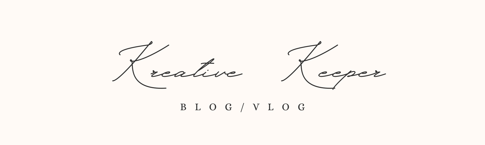

<a name="readme-top"></a>
<div align="center">
  <!-- You are encouraged to replace this logo with your own! Otherwise you can also remove it. -->
  
  <br/>

</div>

<!-- TABLE OF CONTENTS -->

# 📗 Table of Contents

- [📖 About the Project](#about-project)
  - [🛠 Built With](#built-with)
    - [Tech Stack](#tech-stack)
    - [Key Features](#key-features)
  - [🚀 Live Demo](#live-demo)
- [💻 Getting Started](#getting-started)
  - [Setup](#setup)
  - [Prerequisites](#prerequisites)
  - [Install](#install)
  - [Usage](#usage)
  - [Run tests](#run-tests)
  - [Deployment](#triangular_flag_on_post-deployment)
- [👥 Authors](#authors)
- [🔭 Future Features](#future-features)
- [🤝 Contributing](#contributing)
- [⭐️ Show your support](#support)
- [🙏 Acknowledgements](#acknowledgements)
- [❓ FAQ (OPTIONAL)](#faq)
- [📝 License](#license)

<!-- PROJECT DESCRIPTION -->

# 📖 [Kreative Keeper] <a name="about-project"></a>

**[Kreative Keeper]** is a fully functional blog website that shows list of posts and empowers readers to interact with them by adding comments and liking posts

## 🛠 Built With <a name="built-with"></a>

### Tech Stack <a name="tech-stack"></a>

<details>
  <summary>Client</summary>
  <ul>
    <li><a href="https://html.com/">HTML</a></li>
    <li><a href="hhttps://www.w3schools.com/css/">CSS</a></li>
    <li><a href="https://www.javascript.com/">JavaScript</a></li>
  </ul>
</details>

<details>
  <summary>Server</summary>
  <ul>
    <li><a href="https://guides.rubyonrails.org/">Ruby on Rails</a></li>
    <li><a href="https:https://www.ruby-lang.org/en/">Ruby</a></li>
  </ul>
</details>

<details>
<summary>Database</summary>
  <ul>
    <li><a href="https://www.postgresql.org/">PostgreSQL</a></li>
  </ul>
</details>

<!-- Features -->

### Key Features <a name="key-features"></a>

- **[User can add new blog posts]**
- **[User can delete a blog post]**
- **[Other people can like the blog post]**
- **[Other people can comment on the blog post]**

<p align="right">(<a href="#readme-top">back to top</a>)</p>

<!-- LIVE DEMO -->

## 🚀 Live Demo <a name="live-demo"></a>

- [Demo Link](To be added)

- [Live Link](To be added)

<p align="right">(<a href="#readme-top">back to top</a>)</p>

<!-- GETTING STARTED -->

## 💻 Getting Started <a name="getting-started"></a>

To get a local copy up and running, follow these steps.

### Prerequisites

In order to run this project you need:

In order to run this project you need followed installed on your computer:
- Ruby v3+, 
- Rails v7+ 
- PostgreSQL
- An IDE e.g [Visual studio code](https://code.visualstudio.com/).
- [A terminal](https://code.visualstudio.com/docs/terminal/basics).

### Setup

Clone this repository to your desired folder:

```
https://github.com/Recillah-Khamala/kreative-Keeper.git
```

- Navigate to the location of the folder in your machine:

**`you@your-Pc-name:~$ cd Kreative-Keeper`**

### Install

Install this project run:

```sh
bundle install
```

### Usage

To run the project, execute the following command

- After Cloning this repo to your local machine.
- To get it running on your machine, you may open the project on your IDE and open the terminal
- On the terminal you can run:

```sh
rails server or rails s
```
- After which you choose your desired link to open the local server

### Run tests

To run tests, run the following command:

```sh
bin/rails test test/models/article_test.rb
```

### Deployment

You can deploy this project using:

```
to be added
```

<p align="right">(<a href="#readme-top">back to top</a>)</p>

<!-- AUTHORS -->

## 👥 Authors <a name="authors"></a>

👤 **Recillah Khamala**

- GitHub: [@Recillah-Khamala](https://github.com/Recillah-Khamala)
- Twitter: [@recillahk](https://twitter.com/recillahk)
- LinkedIn: [Recillah Khamala](https://www.linkedin.com/in/recillah-khamala/)

<p align="right">(<a href="#readme-top">back to top</a>)</p>

<!-- FUTURE FEATURES -->

## 🔭 Future Features <a name="future-features"></a>

- [ ] **[Add Vlogs]**
- [ ] **[Connect with other social media plartforms]**

<p align="right">(<a href="#readme-top">back to top</a>)</p>

<!-- CONTRIBUTING -->

## 🤝 Contributing <a name="contributing"></a>

Contributions, issues, and feature requests are welcome!

Feel free to check the [issues page](https://github.com/Recillah-Khamala/kreative-Keeper/issues).

<p align="right">(<a href="#readme-top">back to top</a>)</p>

<!-- SUPPORT -->

## ⭐️ Show your support <a name="support"></a>

If you like this project, give a ⭐️on GitHub

<p align="right">(<a href="#readme-top">back to top</a>)</p>

<!-- ACKNOWLEDGEMENTS -->

## 🙏 Acknowledgments <a name="acknowledgements"></a>

I would like to thank microverse team for including this project in the carriculum

<p align="right">(<a href="#readme-top">back to top</a>)</p>

<!-- LICENSE -->

## 📝 License <a name="license"></a>

This project is [MIT](./LICENSE) licensed.

<p align="right">(<a href="#readme-top">back to top</a>)</p>
